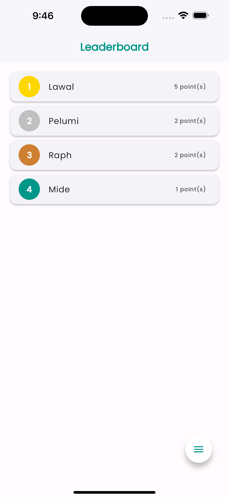
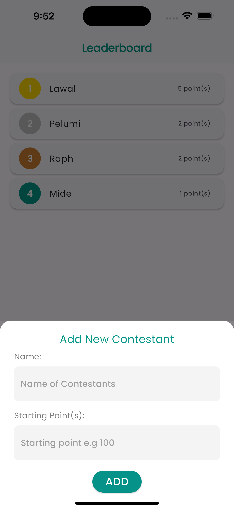
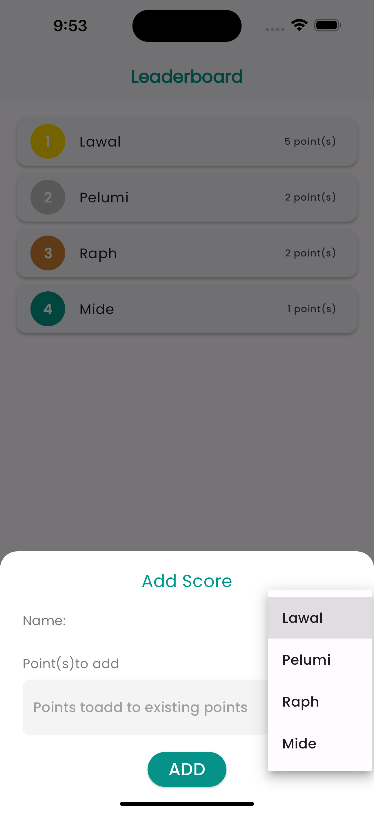

# Point Tracker App

A Flutter app that creates a leaderboard where you can track points for contestants. Features include:

- Add new contestants to the leaderboard
- Update points for existing contestants 
- Delete contestants from the leaderboard
- Visual ranking indicators (gold, silver, bronze) for top 3 positions
- Undo deletion functionality
- Clean and intuitive UI with floating action menu

Built with Flutter and SQLite for local data persistence.

## Screenshots

## Dependencies

- sqflite
- path_provider 
- google_fonts
- fab_circular_menu_plus

